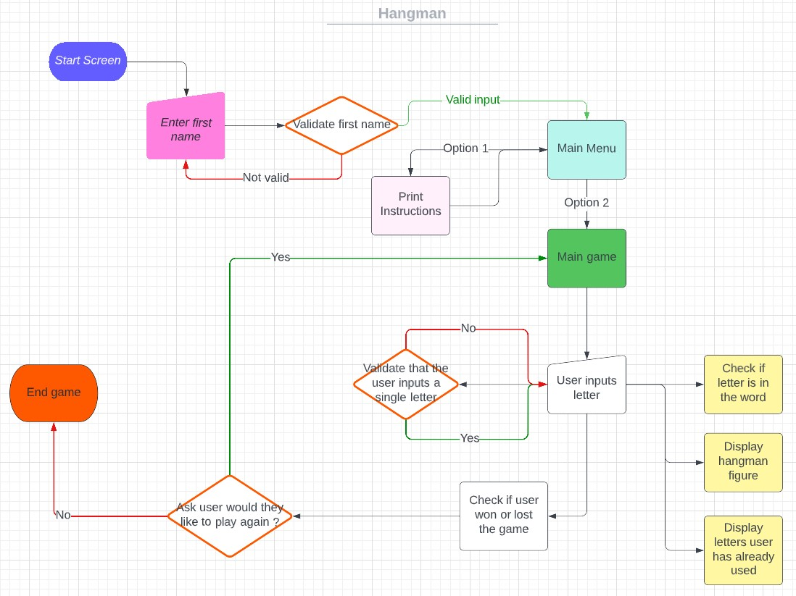
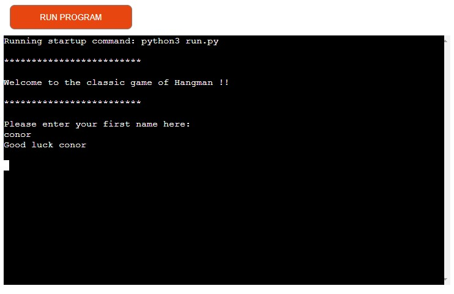
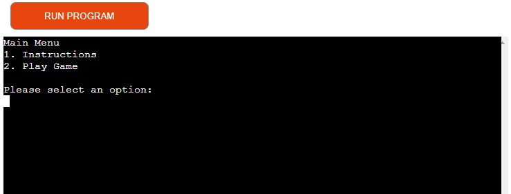
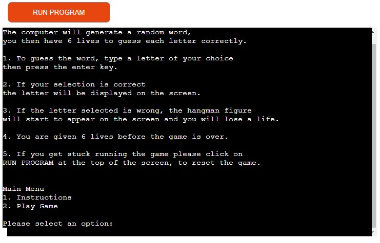
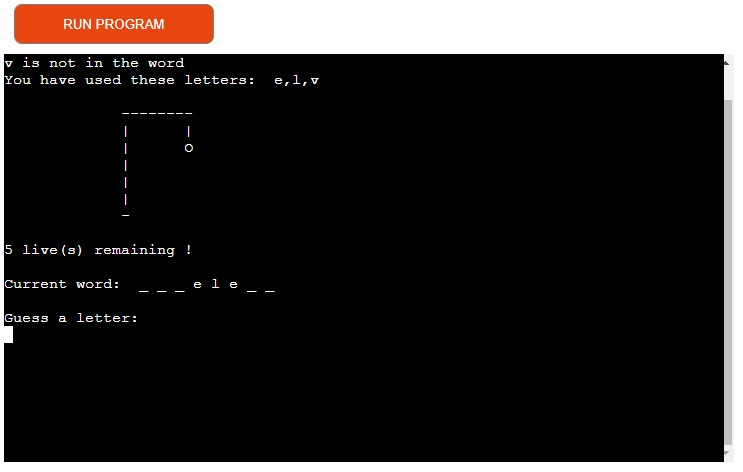
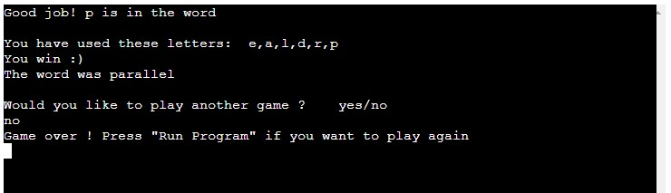
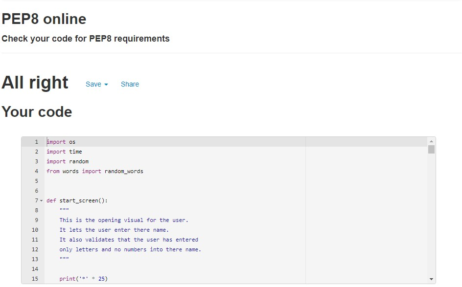

# Hangman
Traditionally hangman is a guessing game for two or more players. One player thinks of a word or phrase and the other(s) tries to guess it by suggesting letters within a certain number of guesses.

My version of the game allows only one user at a time to play. The computer will randomly pick a word from a predefined list of words. The random word will then be displayed with '_' for each letter in the random word. Then the user can try to guess the word by inputting letters, if the letter is wrong a visual of the hangman man will start to appear, if the letter is in the word the letter appears and another guess can be made. The user can keep guessing letters until either all 6 lives are used or the user has successfully guessed all the correct letters. The aim is to supply a fun word guessing game to the user.

[Link to deployed game.](https://p3-hangman.herokuapp.com/)

## User Experience(UX)
### User goals
* A nice welcome screen which lets the user interact with the game immediately.
* The game menu is very clear and user-friendly.
* The instructions are easily read and easily understood by the user.
* There is a good flow to the application.
* The game itself is very clear and easy to interact with.
* To be given the oppurtunity to play another round of the game.

## Flowchart
The flowchart was created on [Lucid Chart](https://www.lucidchart.com/pages/). It was created to give me a rough idea and outline of how I wanted the program to flow from start to finish.

The flow chart shows these stages of the process:
* The user inputs their first name and the program validates the data.
* Give the user the option to read the instructions or go straight to the game.
* The user then inputs a letter, the program validates the input and starts displaying the information for the user.
* User is given the opportunity to play again or exit the game.

## Features
### Start Screen
* The start screen welcomes the user to the game.
* It also lets the user input their first name and the game wishes the user good luck.

### Main menu
* The main menu allows the user to check out the instructions for the game by inputting the corresponding number.
* The user also enters the main game from the main menu by inputting the corresponding number. 

### Instructions
* The instructions section clearly outlines how the game works for the user.
* The main menu comes up here again so the user can continue to the main game.

### Main Game
* In the main game the user will be able to see: 
    * The letter they have just selected and whether or not it is in the word.
    * All the previous letters they have used.
    * The stages of the hangman figure.
    * How many lives they have remaining.
    * The current word they are trying to guess.
    * The user will be given the option to play again after they have won or lost.
    * Game will exit if the user selects 'no'.

### Future Features
* A possible future idea is to make it two player, so player one can type in any word of their choice the word will then be hidden and player two will have to guess the word.
* Making the game into different levels so a group of easy words, medium words and hard words to accommodate all skill levels. 
* Adding a timer to the game to make it more difficult. 

## Testing
* Throughout my project I used the gitpod terminal to run and test that each function was working correctly as I created them.
* I got some of my friends to test the game to make sure the game was running smoothly. Although the game ran smoothly for them they found a lot of the words very tricky so I changed my list.
### Validator testing
* I ran my code through the [PEP8 Validator](http://pep8online.com/) with no issues.

## Bugs
* While doing the another_game function the else statement was just printing out an infinite amount of the string. This bug was fixed by surrounding it in a while loop.

## Deployment
This project was developed using GitPod and deployed via GitHub to Heroku.

The following steps were taken to deploy this project:

1. From the Heroku dashboard, select 'New' and 'create new app'.
2. Type in the app name (this has to be unique) and then choose the region closest to your location. Now click on 'Create app'.
3. In the application dashboard go to settings and click on 'Reveal Config Vars'.
4. In the 'KEY' tab type 'PORT' and in the 'VALUE' tab type '8000'.
5. Next click on 'Add buildpack' and select 'python' and 'nodejs' in that order.
6. Then, at the top of the page click on the 'Deploy' section.
7. Here, select 'GitHub' as the deployment method.
8. Connect to your GitHub account and then in the 'Connect to Github' section, search for the project repository and press 'Connect'.
9. Scroll down to the 'Manual Deploy' section and select which branch to deploy from.
10. Then hit the 'Deploy branch' button.
11. When the project has been successfully deployed (this may take a few minutes), click on the 'view' button, which will appear on the screen. When clicked, it will open the deployed application.

## Credits
* Thanks to [Code Institute](https://codeinstitute.net/ie/) for the terminal in which this project runs and for the 'Love Sandwiches' walkthrough which helped a lot as I have no previous experience with Python. 
* The idea for the function to clear the terminal came from [101computing.net](https://www.101computing.net/python-typing-text-effect/).
* The structure for the hangman figure came from the [Kite](https://www.youtube.com/watch?v=m4nEnsavl6w) youtube channel.
* I got help with a couple of the functions from the [freeCodeCamp.org](https://www.youtube.com/watch?v=8ext9G7xspg&t=1701s) youtube channel.
* Big thanks to everyone at Code Institute between the staff and students.